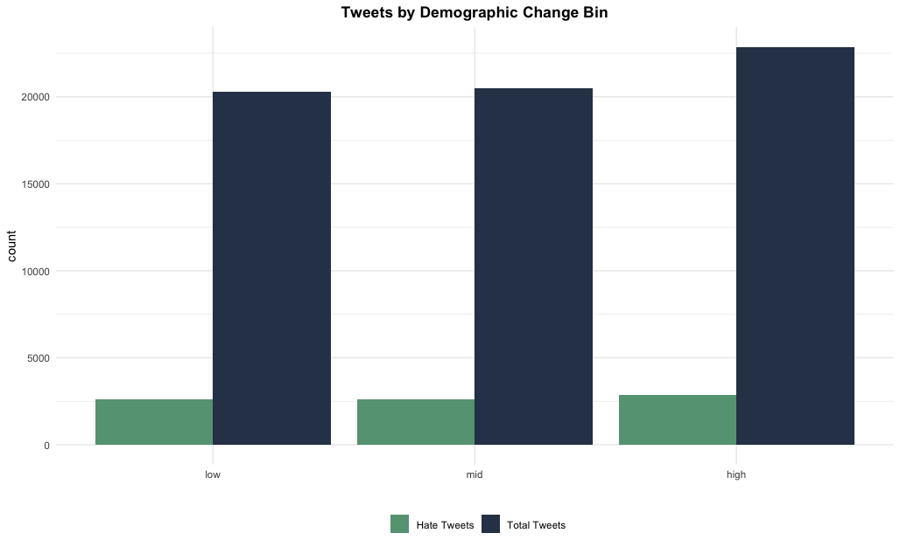
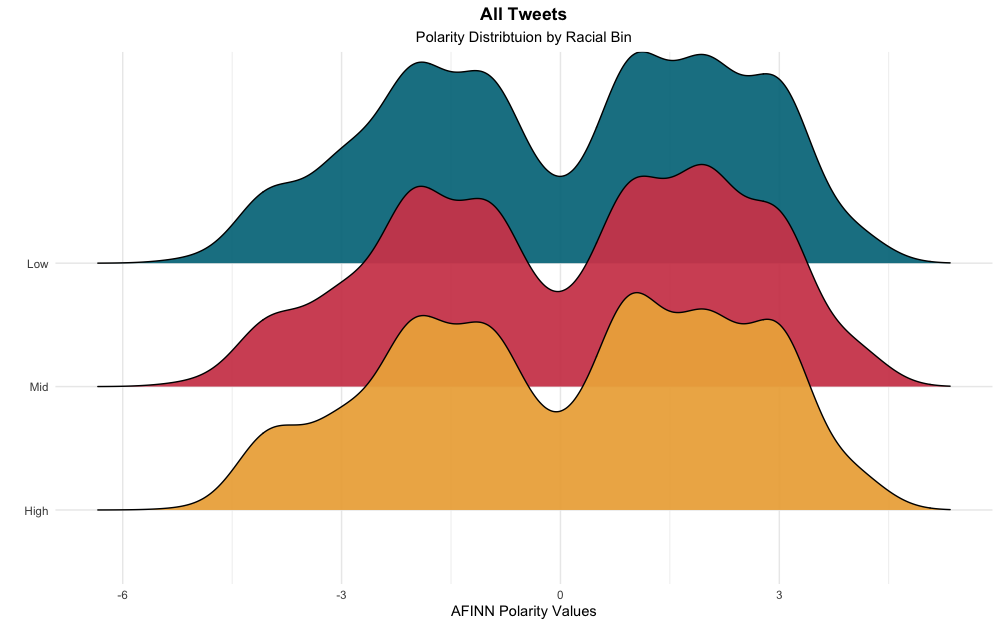

# Ambient Demographic Change as a Predictor of Online Hate Speech

This project seeks to quantify behavioral differences in areas with rapidly changing racial demographics. Expanding on the substantial experimental literature in this area, the current project leverages Census and Twitter data to assess differences in online speech between areas with high, medium, and low degrees of racial change in the last 20 years.

## Methods

### Acquistion

* Data was scraped using the US Census API and cleaned in R
* Population % deltas were calculated for total population, Hispanic, and Non-Hispanic White populations at the county (FIPS code) level

* Counties were binned into `high`, `mid`, and `low` change groups as a factor of their Hispanic population % since the year 2000

* A random sample of 100 counties was selected from each bin
* 200 tweets were collected from each county and cleaned in Python

### Analysis

* A `stochastic gradient descent classifier` was trained on labeled hate speech data from a previous project, yielding a reasonable `F1` score of `0.96`

* A first-pass at analysis did not demonstrate significant differences between racial change counties in this project (neither global tweets nor user-to-user mentions yielded differences here)

* A secondary analysis using AFINN polarity scores did not yield significant differences either, after tokenizing each tweet and averaging the valence

## Future Directions

To best understand the relationship between status threat and online behavior, a more reliable geographic marker will be required (Twitter Places are not nearly fine-grain enough for our purposes, especially in rural counties). Options here may include NextDoor or other public forums, where access is allowable only to residents of that particular area. More to come!