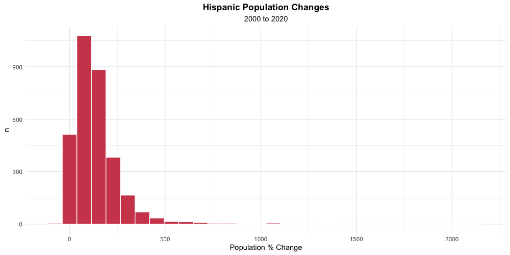
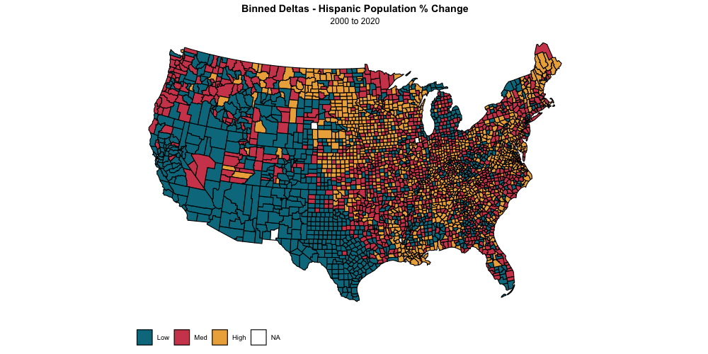

# Ambient Demographic Change as a Predictor of Online Hate Speech

This project seeks to quantify behavioral differences in areas with rapidly changing racial demographics. Expanding on the substantial experimental literature in this area, the current project leverages Census and Twitter data to assess differences in online speech between areas with high, medium, and low degrees of racial change in the last 20 years.

## Methods

### Acquistion

* Data was scraped using the US Census API and cleaned in R
* Population % deltas were calculated for total population, Hispanic, and Non-Hispanic White populations at the county (FIPS code) level

* Counties were binned into `high`, `mid`, and `low` change groups as a factor of their Hispanic population % since the year 2000

* A random sample of 100 counties was selected from each bin
* 200 tweets were collected from each county and cleaned in Python

### Analysis

{ ongoing }

